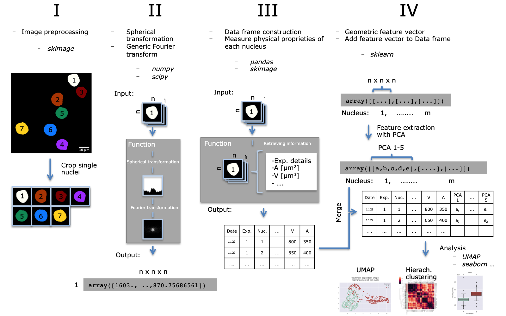

# Morphological feature extraction of cell nuclei with generic Fourier transform

This project was inspired by [Wagner et al., 2019](https://ieeexplore.ieee.org/document/8856734).  

## Overview and Workflow

The whole workflow is implemented using Jupyter Notebook where each section from I-IV is explained in detail.  

### Data
There are two folders with data provided to play around:
- Small dataset containing binary 3-D MNIST [] [LeCun et al., 1998a](https://ieeexplore.ieee.org/document/726791)
- Dataset with single nuclei treated with treatment A 16h and treatment A 16h + B 1h []

